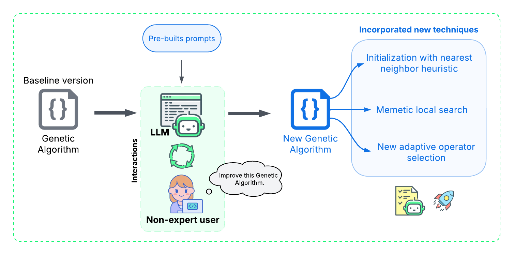

# Combinatorial Optimization for All



**Abstract:** Large Language Models (LLMs) have shown notable potential in code generation for optimization algorithms, unlocking exciting new opportunities. This paper examines how LLMs, rather than creating algorithms from scratch, can improve existing ones without the need for specialized expertise. To explore this potential, we selected 10 baseline optimization algorithms from various domains (metaheuristics, reinforcement learning, deterministic, and exact methods) to solve the classic Travelling Salesman Problem. The results show that our simple methodology often results in LLM-generated algorithm variants that improve over the baseline algorithms in terms of solution quality, reduction in computational time, and simplification of code complexity, all without requiring specialized optimization knowledge or advanced algorithmic implementation skills.

Homepage: [https://camilochs.github.io/comb-opt-for-all/](https://camilochs.github.io/comb-opt-for-all/)

## Contents of This Repository

- The `prompt_template` and the prompts used to generate the 10 algorithms can be found in the `prompts/` directory.
- The algorithms generated from these prompts for each LLM (Claude-3.5-Sonnet, GPT-O1, Llama-3.3-70b, Gemini-exp-1206, DeepSeek-R1) are stored in `results/algorithms_improved_LLMs/`.
  - **Note:** In cases where an LLM failed to generate an algorithm (see Table 2 of the paper), we have omitted those prompts and only included the final algorithm.
- The 10 original algorithms were extracted from the **[pyCombinatorial](https://github.com/Valdecy/pyCombinatorial)** framework (version from late February 2025).
  - Special thanks to **Valdecy Pereira**, the creator of the framework, for kindly addressing our inquiries.

> LLMs can assist not only researchers in enhancing their optimization algorithms but also non-experts seeking quick and efficient solutions, as well as those using them for educational purposes.

## Research Findings

Our research is detailed in the paper:
**[Combinatorial Optimization for All: Using LLMs to Aid Non-Experts in Improving Optimization Algorithms]()** – Check it out!

## Cite

```


```
